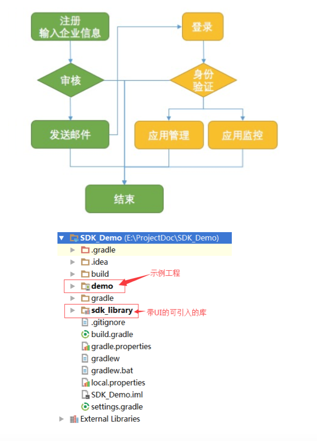

<!--
下面这行是真正的编译状态

-->

#信源豆豆Android SDK快速入门
###快速开始
* 开始集成豆豆SDK
* 加入豆豆，注册豆豆账号
* 在开发者后台创建App，获取token与授权证书
* 下载SDK，通过SDK连接到App服务器
* 发送消息，设置用户信息提供者
* 进行UI界面定义和功能调整
* 提交上线申请，应用市场上线

###架构介绍

###SDK注册审核流程

###SDK集成开发准备
####1.前往应用证书申请地址: [http://www.linkdood.cn/server-linkdood/reg](http://www.linkdood.cn/server-linkdood/reg)，申请开发所必须的证书（证书使用详见后面说明）
####2.证书会在管理员审核信息通过并后发送给开发者
####3.SDK相关资源从我们的开发者中心可以下载到。包括SDK库文件、VIMSDKDemo以及相关集成文档和API文档。
####下载地址:[http://blog.linkdood.cn/doku.php?id=wiki:sdk](http://blog.linkdood.cn/doku.php?id=wiki:sdk)
####4.本文详细介绍关于VIMSDKDemo相关说明（android studio开发环境）
####项目结构如下图：

####5.其他相关接口的调用请参看DEMO功能实现以及相关API文档
